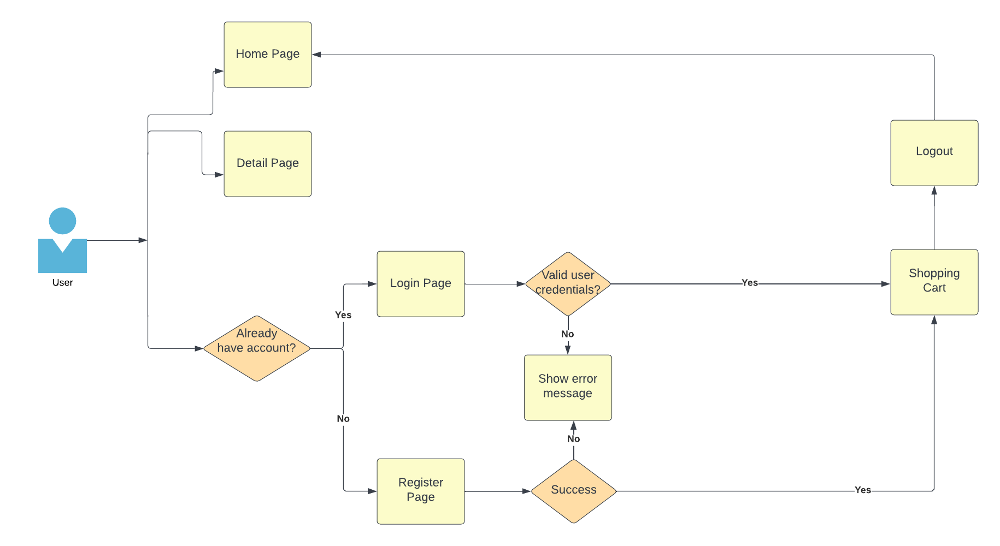

# react-training

## OVERVIEW

- This document describes in detail the time, workload, and technical stacks used in the exercise. This method creates a Web App that sells video games with the goals that I can apply my advanced knowledge of React.

## FLOW APP

## REQUIREMENT

- User can login, logout, register
- Validation form, handle error
- Redirect pages
- Show list of items
- Add items to cart, delete item, delete all items when user authenticated
- Calculate items price
- Show detail each item
- Search items by name
- Show user full name when login or register
- Show the login/register button for anonymous users
- Show cart icon (when user authenticated) and show a badge number (the number of items in the cart)

## TARGETS

- Apply useContext, and useReducer in state management.
- Optimize performance with useCallback, useMemo, React.memo.
- Apply unit testing to cover above 90% line of code.

## DESIGN

- [Figma](https://nekusu.github.io/shopping-cart/#/games)

## TECHNICAL

- [TypeScript](https://www.typescriptlang.org/docs/handbook/typescript-in-5-minutes.html): TypeScript is a typed subset of Javascript that compiles to plain JavaScript. Any browser, any host, any OS. Open source.

- [ReactJS](https://reactjs.org/): ReactJS is a JavaScript library for building user interfaces.

- [Vite](https://vitejs.dev/): Vite is a build tool that aims to provide a faster and leaner development experience for modern web projects.

- [React router dom](https://reactrouter.com/en/main): React-Router is a standard routing library in React. It keeps the app's interface in sync with the URL in the browser.

- [SWR](https://swr.vercel.app/): SWR is a library of react hooks used to fetch data.

- [json-server, json-server-auth](https://github.com/jeremyben/json-server-auth): JSON Server Auth provides generic guards as route middleware.

- [React hook form](https://react-hook-form.com/): Performant, flexible and extensible forms with easy-to-use validation.

- [Storybook](https://storybook.js.org/): Is an open source tool for developing UI components in isolation for React, Vue, and Angular. It makes building stunning UIs organized and efficient.

- [Unit Test with React Testing](https://testing-library.com/docs/react-testing-library/intro/): Simple and complete testing utilities that encourage good testing practices

- [Material UI](https://mui.com/material-ui/getting-started/overview/): MUI offers a comprehensive suite of UI tools to help you ship new features faster. Start with Material UI, our fully-loaded component library, or bring your own design system to our production-ready components.

## TASK MANAGEMENT

- [Trello](https://trello.com/b/m414lamx/react-practice-3) :Trello is an intuitive task management tool that helps teams brainstorm, plan, manage, and celebrate achievements together in a collaborative, efficient, and organized way.

## EDITOR

- Visual studio code

## TIMELINE

- Estimate time: Nov 15, 2022 to Nov 29, 2022
  - Working days: 1 day to make a document, 10 days to code.

## GETTING STARTED

All commands are run from the root folder, from a terminal:

| Command                                                                                  | Action                        |
| :--------------------------------------------------------------------------------------- | :---------------------------- |
| `$ git clone -b feat/practice3 git@gitlab.asoft-python.com:long.tran/react-training.git` | Clone Repository              |
| `$ cd react-training/Practice3/GAME-PROJECT/`                                            | Redirect to folder            |
| `$ npm i pnpm`                                                                           | Install packages pnpm         |
| `$ pnpm install`                                                                         | Install packages dependencies |
| `$ pnpm dev`                                                                             | Run webpage                   |
| `$ pnpm run server`                                                                      | Run database                  |
| `$ pnpm run storybook`                                                                   | Run Storybook                 |
| `$ pnpm test`                                                                            | Run Unit Test                 |

## DEPENDENCIES

| Dependence | Version | References           |
| :--------- | :------ | -------------------- |
| react      | v18.2.0 | `$ pnpm i react`     |
| react-dom  | v18.2.0 | `$ pnpm i react-dom` |
